# DialogFlowQA

【工程运行】
 运行dialogflow_api_client.py

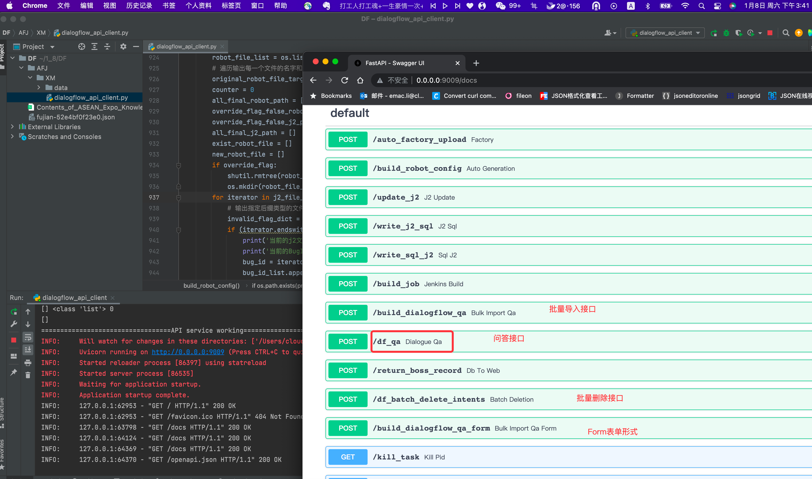

 

 调用【问答】接口

http://0.0.0.0:9009/docs#/default/dialogue_qa_df_qa_post

 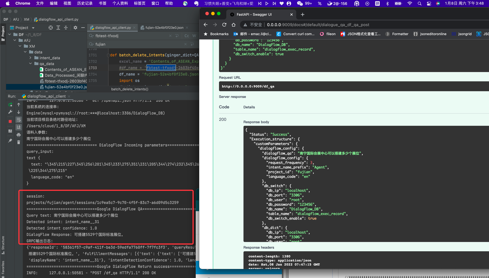

 

 

【批量问答对表格录入】

http://0.0.0.0:9009/docs#/default/bulk_import_qa_form_build_dialogflow_qa_form_post

 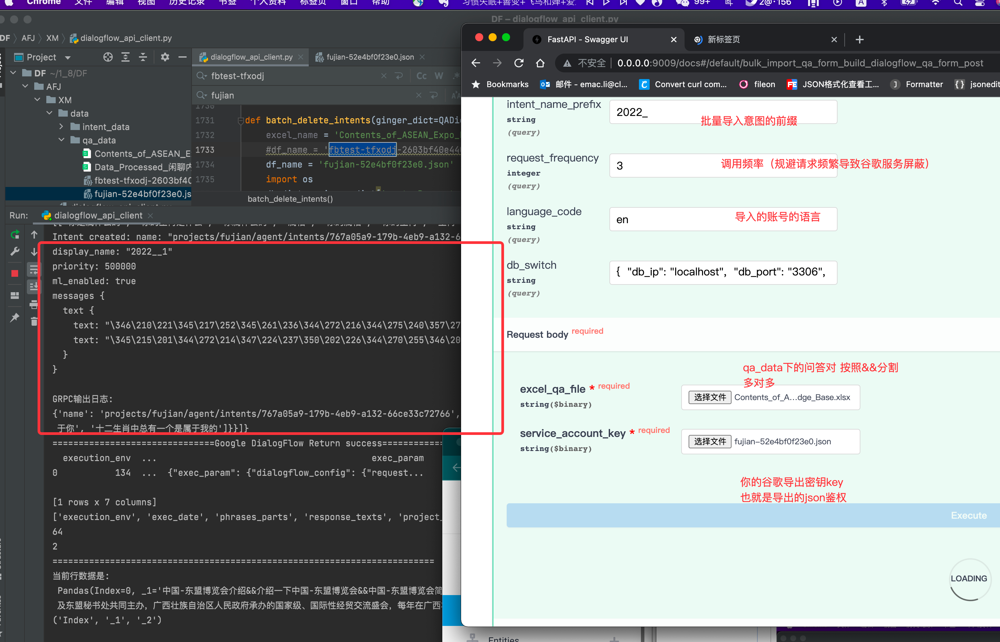

 

 
【配置谷歌DialogFlow key】
https://console.cloud.google.com/projectselector2/iam-admin/serviceaccounts?supportedpurview=project
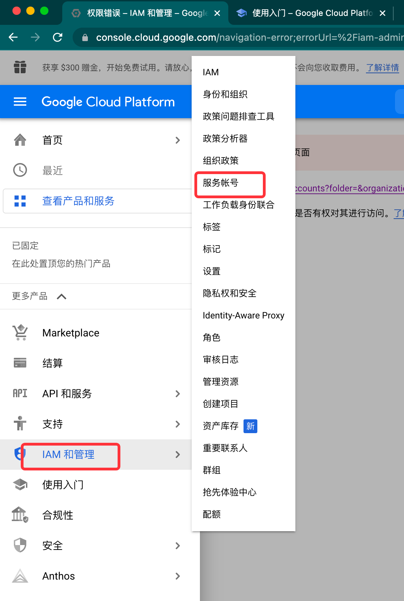
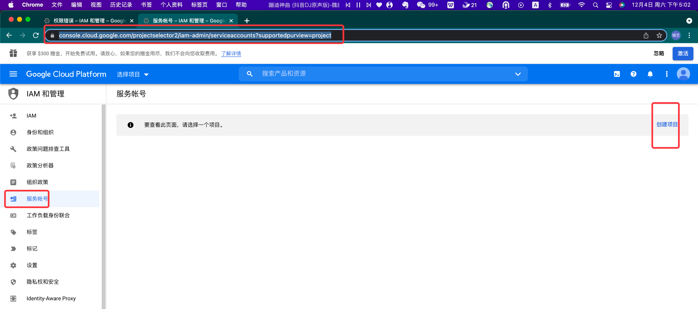

创建后生成
https://console.cloud.google.com/iam-admin/serviceaccounts?project=fujian&supportedpurview=project

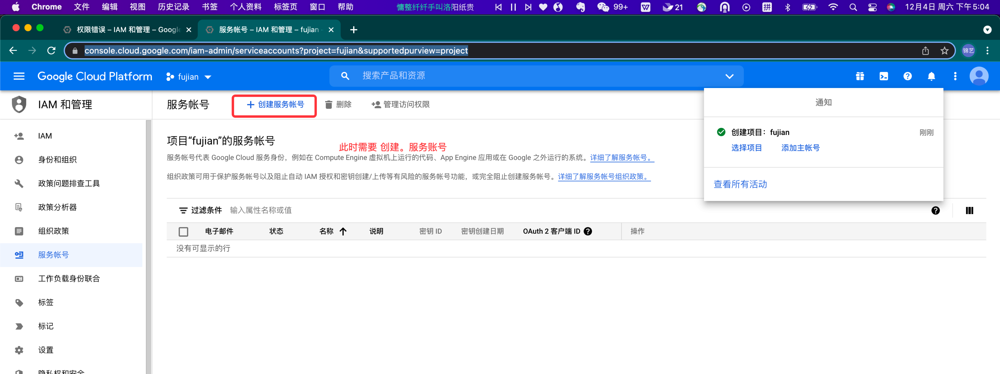
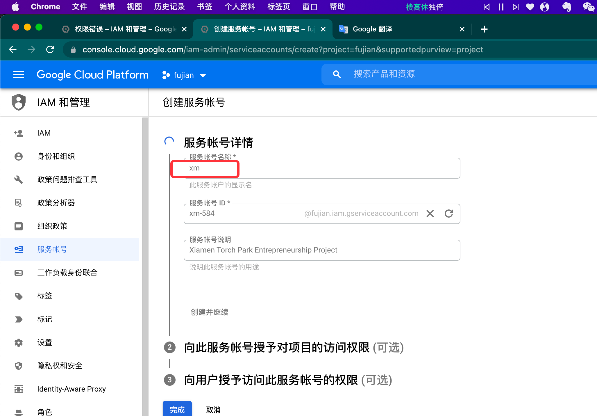

权限设置
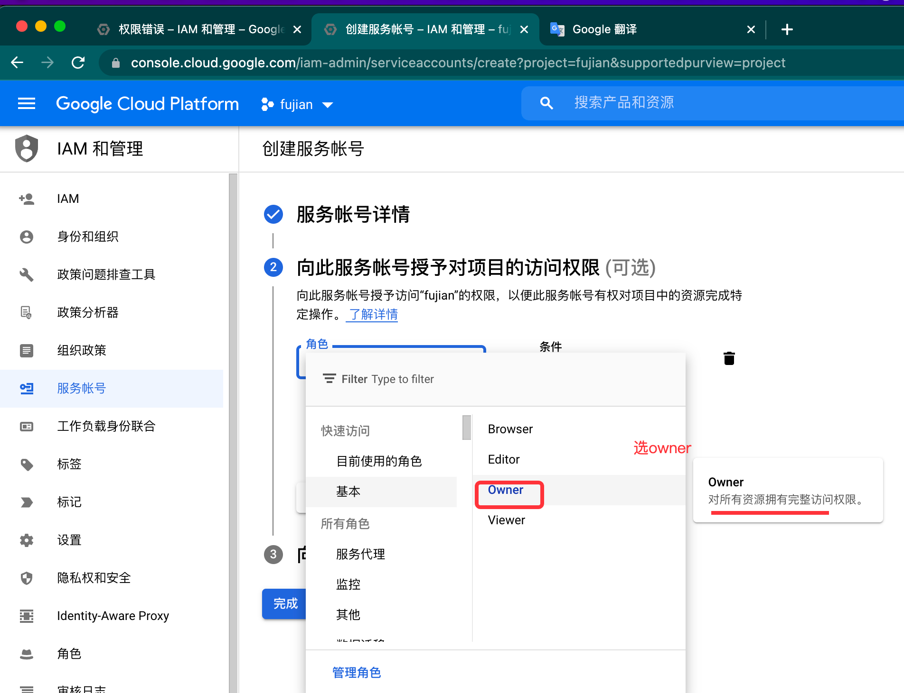

选配

进入密钥创建详情页
https://console.cloud.google.com/iam-admin/serviceaccounts/details/101331898446695371760/keys?project=fujian&supportedpurview=project
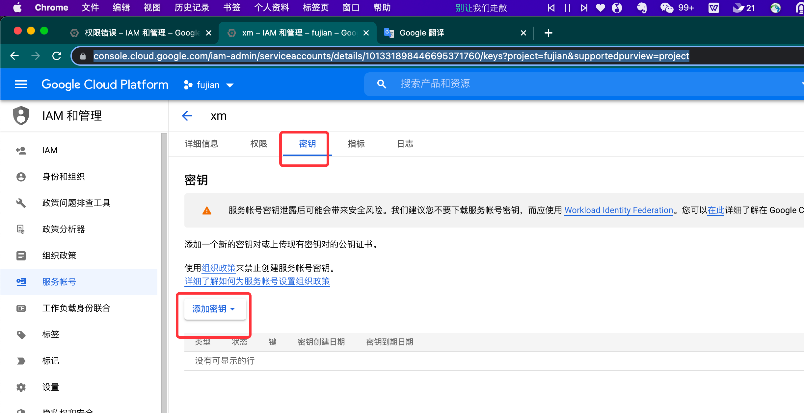

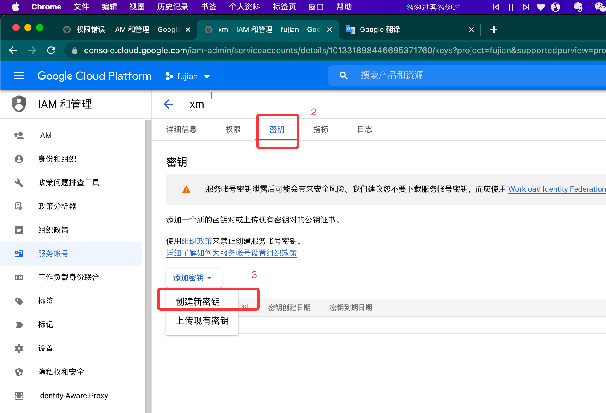

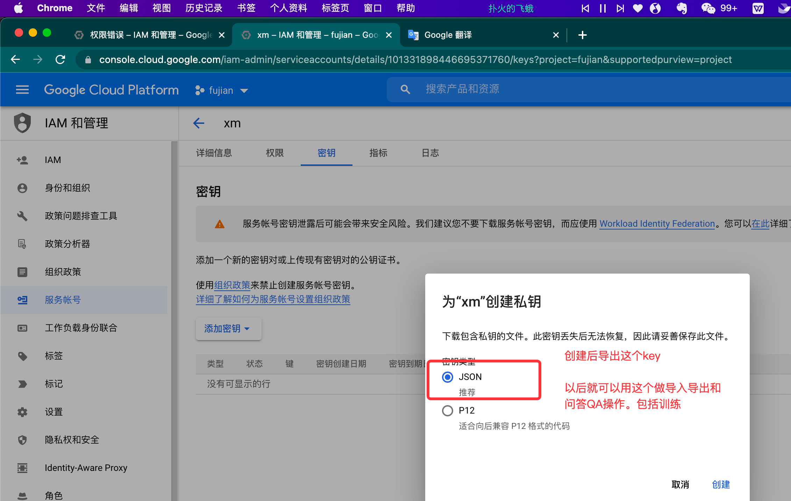

https://console.cloud.google.com/apis/api/dialogflow.googleapis.com/overview?project=fujian